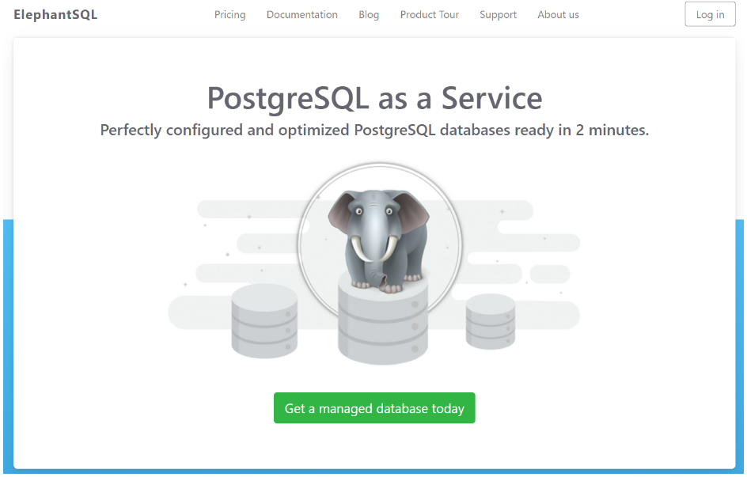
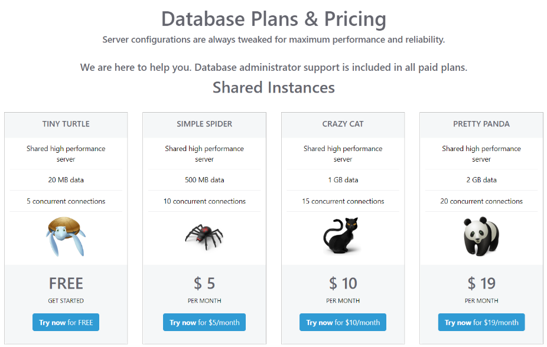
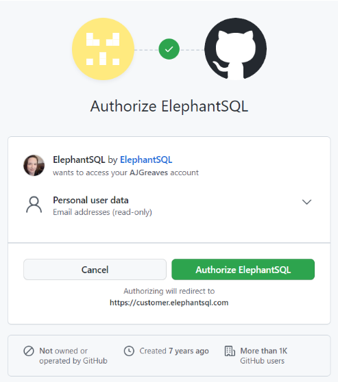
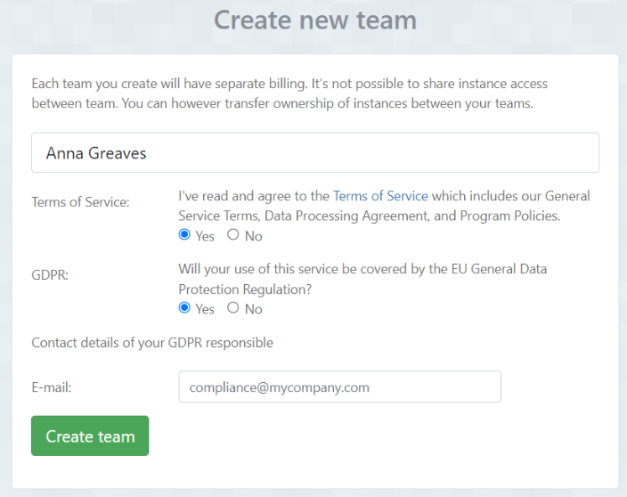
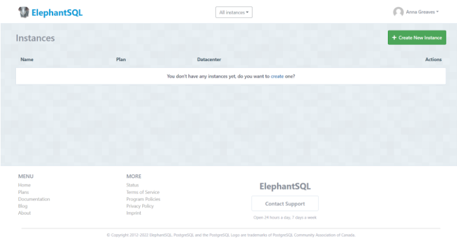

# Sign Up

Follow these steps to create an account on ElephantSQL to allow the instantiation of PostgreSQL databases.

1. Navigate to [ElephantSQL.com](https://elephantsql.com) and click "**Get a managed database today**":\
   \

2. Select "**Try now for FREE**" in the TINY TURTLE database plan:\
   \

3. Select "**Log in with GitHub**" and authorize ElephantSQL with your selected GitHub account:\
   \

4. In the **Create new team** form:
   * Add a **team name** (your own name is fine)
   * Read and agree to the Terms of Service
   * Select Yes for GDPR
   * Provide your email address
   * Click "**Create Team**"\
     \

5. Your account is successfully created!\
   

Congratulations, you are now signed up to ElephantSQL and are ready to create your databases!
