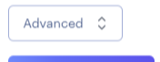
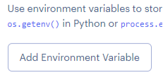
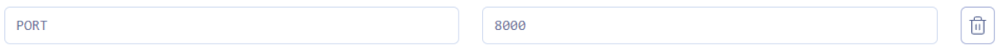
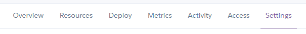
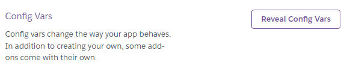
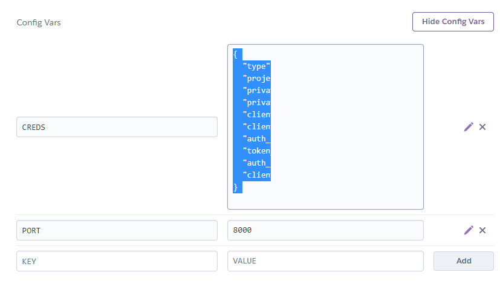
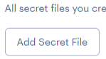
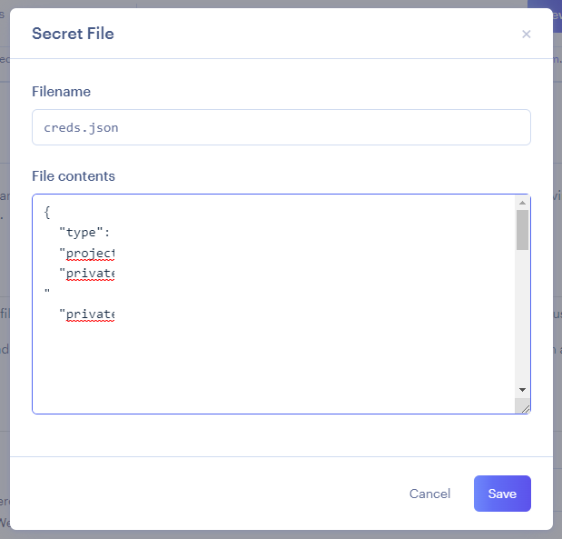

# Python Essentials: Environment variables

During the development process you may have used a creds.json file which contained sensitive information. For the application to perform correctly, this information is required in the production environment. Luckily, Render provides a couple of ways to give your application access to these details without exposing them to the public.

### Individual Variables

This allows the addition of individual environment variables.

This would be a good place for development and debug variables when needed.

### Secret File

This file will be available 'behind the scenes', it is not accessible to the public so the security and secrecy of its content are maintained.


This also acts as a nice backup location of production environment variables should a GitPod workspace be lost without another external backup of the `creds.json` file.


### Process

1\. Locate and click "**Advanced**"

<figure><figcaption></figcaption></figure>

2\. Click "**Add Environment Variable**"

<figure><figcaption></figcaption></figure>

3\. Add the following environment variable

<figure><figcaption></figcaption></figure>

| Key  | Value |
| ---- | ----- |
| PORT | 8000  |


This value is required for the Python mock terminal program - do not change it!



If your project does not require a `creds.json` file, skip to the next page.


4\. Open a new browser tab and navigate to your Heroku dashboard and open the **Settings** tab of your existing app

<figure><figcaption></figcaption></figure>

5\. Click "**Reveal Config Vars**"

<figure><figcaption></figcaption></figure>

6\. Copy the value of your **CREDS** variable to your clipboard

<figure><figcaption></figcaption></figure>

7\. Back in Render, click "**Add Secret File**"

<figure><figcaption></figcaption></figure>

8\. Paste in the copied text to the **File contents** text area input and ensure the **Filename** is **creds.json**

<figure><figcaption></figcaption></figure>


Make sure to click "**Save**" when done.


### Up Next

The final option is whether to **Auto-Deploy**. The two options are explained in the following page.
