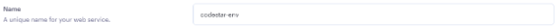
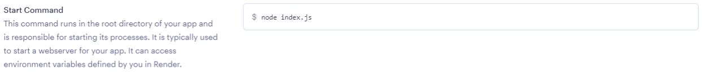
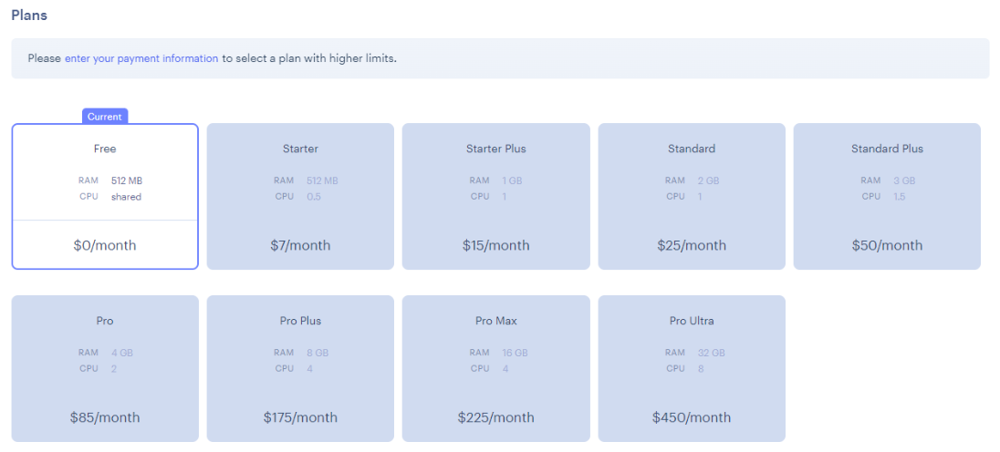

# Python Essentials : Settings

A brief explanation of each setting is given below.

### Settings

#### Name

A name is chosen to help identify the deployment. This will be listed in the Render dashboard overview.

The name chosen will form part of the deployed URL. If the name is unique on Render.com, the resulting URL will be `<name>.onrender.com`. If the name is _not_ unique, a random hash with be appended to the name given, e.g. `<name>-3yk1.onrender.com`

#### Root Directory

The root directory of the project and its content. This can be edited if required, but usually it will remain blank, thus indicating the root directory of the repository is the same as the root directory of the web service.

#### Environment

The nature of the program so Render.com knows which of their configurations to use. With Python selected, Render will use the latest patch version of Python 3.7 as a default, but this is configurable.

#### Region

The physical location of the server hosting the web service. The location will slightly effect loading speeds etc.

#### Branch

The branch that the service should be deployed from. This will often be `main` (or `master` for older repositories) but is configurable to any public branch within the repository.

#### Build Command

This is the command that is executed when the deployment build is initiated. The command instructs the build to install the pip packages from the requirements.txt file and to install all Node dependencies listed in the package.json file within the repository.

The Node dependencies may be unfamiliar to you but they are used to comprise the pseudo-terminal and allow a terminal-based Python project to operate within a browser environment. The template used for this project had all the necessary Node configuration pre-populated for you.

#### Start Command

This is the executable command that is run once the build has completed. `node` indicates the runtime environment to run the command in, in this case Node.js. The succeeding `index.js` indicates the name of the file to be run within Node.

### Process

1\. Add a **Name**

<figure><figcaption></figcaption></figure>

2\. Ensure the following settings match

| Setting Name   | Value                                                                                                                                 |
| -------------- | ------------------------------------------------------------------------------------------------------------------------------------- |
| Root Directory | \*\*blank\*\*                                                                                                                         |
| Environment    | **Python 3**                                                                                                                          |
| Region         | <p><strong>Frankfurt (EU Central)</strong><br><br><em>For those outside of Europe, a more localized region may be preferred.</em></p> |
| Branch         | <p><strong>main</strong><br><br><em>You can deploy from a different branch if required.</em></p>                                      |

3\. Set the **Build Command**

<figure><figcaption></figcaption></figure>


```shell
pip install -r requirements.txt && npm install
```



Using `&&` in a terminal command means that anything following the `&&` will only be performed on a successful execution of the previous command.


4\. Set the **Start Command**

<figure><figcaption></figcaption></figure>

```shell
node index.js
```

5\. Ensure the **Free** plan $0/month is selected.

<figure><figcaption></figcaption></figure>


The requirements of the project are well within the free services offered by Render.com. Feel free to explore their [pricing structure](https://render.com/pricing) and [free plan limitations](https://render.com/docs/free#free-web-services).


### Up Next

The environment variables are needed. The next page details how to add them.
