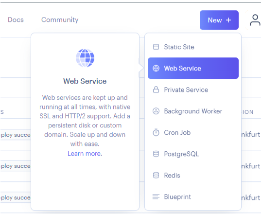

# Python Essentials : Web Service creation

A web service allows a full stack application to be deployed. Connecting it to a repository on GitHub allows the repo to be built and deployed on Render's hosting platform.

### Process

1. Click "**New +**"\
   \
   
2. Click "**Web Service**"\
   \
   
3. Search for relevant repo and click "**Connect**"\
   \
   

### Up Next

Now a series of configuration settings are required. Some key notes and guidance are provided on the next page.
