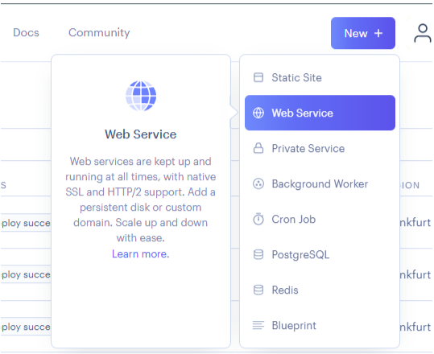

# Installing your GitHub repositories

Follow these steps to give Render access to your GitHub repositories for deployment of full stack web applications.

1\. Click "**New +**" and select "**Web Service**"\
\
\
\

2\. On the right of the page, select "**+ Connect account**" for GitHub\
\
\
\

3\. Select your GitHub account\
****\
****\
\
****

4\. Ensure **All repositories** is selected and click "**Install**"\
****\
********\
****

Now your Render account is set up and connected to GitHub, you are ready to deploy your first project.
