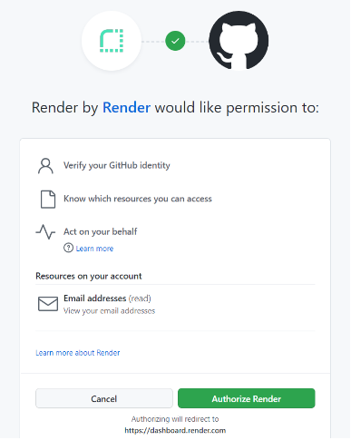
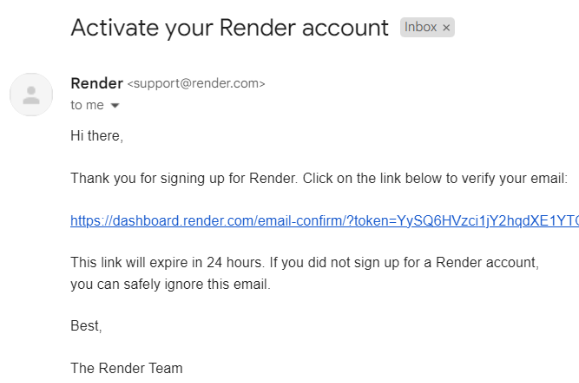

# Sign Up

Follow these steps to create an account on Render to allow the deployment of full stack web applications.


Skip to [Installing your GitHub repositories](installing-your-github-repositories.md).


1\. Visit [Render.com](https://render.com) and click "**Get Started**"\

<figure><figcaption>
 
</figcaption></figure>

2\. Sign up for Render with **GitHub**\
****

<figure><figcaption>
 
</figcaption></figure>

3\. Log into GitHub (if needed) and then select "**Authorize Render**"\
\
\
\

4\. Confirm your email address and click  "**Complete sign up**"\
\
\
\

5\. Open your email account and click the email verification link\
\

### Up Next

Now you have an account with Render, let's get it connected to your GitHub repositories.
