# ‼ Troubleshooting

Sometimes a build will not show any progress, and unfortunately, sometimes it will fail to start at all. You may also receive a 404 error when visiting the deployed link, or find CSS not being applied as expected and other oddities.

### General

#### Wait...a while!

Once the build has started, we suggest continuing with some other activities for around **15 minutes** <mark style="color:red;"></mark> and then attempting to open the deployed site via the **link below your WEB SERVICE name:**

<figure>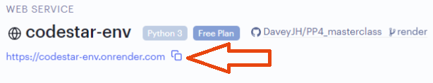<figcaption></figcaption></figure>

If you leave the console page, you can view the progress of the current deployment via the **Events** tab:

<figure>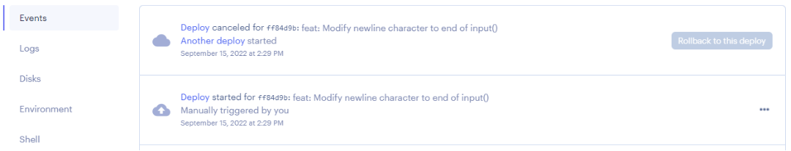<figcaption></figcaption></figure>

The second deployment in the screenshot above is currently in progress, noted by the three dots on the right hand side. To view the console for that build, click **Deploy** on that entry.

Once the build is successful, the deployment will take a few more minutes:

<figure>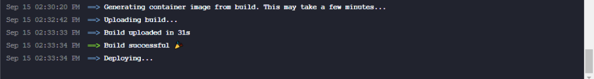<figcaption></figcaption></figure>


If the deploy fails for any reason, restart via the Manual Deploy options and select "Deploy latest commit" detailed in [Failed Deployments](troubleshooting.md#undefined) below.


#### Deployment Delays

If you believe the deployment has completed and you receive a 404 error, or some styling appears not to have loaded:

Due to the nature of the deployment process, we suggest **waiting a further 10 minutes** and then doing a **cache refresh** of your deployed site. If you are still having issues, please explore the steps below.

### Console

We advise checking the **Events** tab once the <mark style="color:green;">**Build successful 🎉**</mark> message is shown, as the build page does not always update to show **Live**, instead it remains on **…in progress**:

<figure>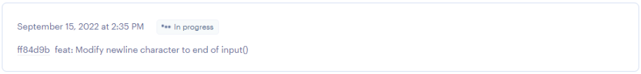<figcaption></figcaption></figure>

A successful build in the **Events** tab will show:

<figure>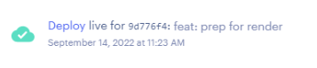<figcaption></figcaption></figure>

The build log _may_ update, but not always:

<figure>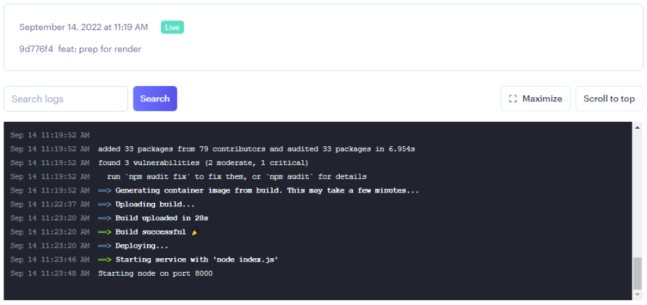<figcaption></figcaption></figure>


Clicking **Deploy** on a deployment entry in the **Events** tab will display the build log for that deployment.



On occasion, when starting a deployment the console does not update at all. In this instance, we advise restarting the deployment via the Manual Deploy options and select "Deploy latest commit" detailed in [Failed Deployments](troubleshooting.md#undefined) below.


### Failed Deployments

If the deployment has failed for any reason, often noted by a red "**Failed**" note on the deployment 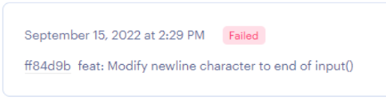, follow the steps below:

1. Click "**Manual Deploy**":\
   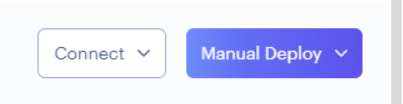
2. Click "**Clear build cache & deploy**":\
   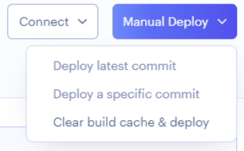
3. Wait for the deployment and watch the console for some activity:\
   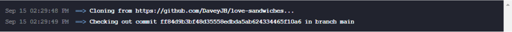
4. If the build still fails, you can try selecting "**Deploy latest commit**".

### Branches

If you are familiar with branches:

* If you have Auto-Deploy set to Yes, the automatic deployment will only trigger if you deploy to the relevant branch.
* You have the option of manually triggering a deployment at any time by following the steps in [Failed Deployments](troubleshooting.md#failed-deployments).

### Python Version

By default, Render uses the latest patch version of Python 3.7.

You can customize the Python version for your app by setting the **PYTHON\_VERSION** environment variable to a valid Python version. To do so, open up the **Environment** tab within your Web Service and click **Add Environment Variable**.

<figure>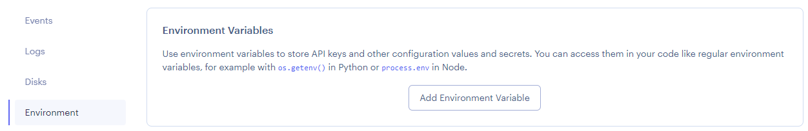<figcaption></figcaption></figure>

<figure>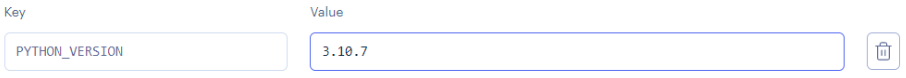<figcaption></figcaption></figure>


A manual deployment is advised following the modification of any environment variables. Consult the steps in [Failed Deployments](troubleshooting.md#failed-deployments) for guidance on manually deploying.

