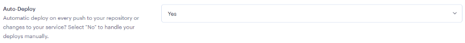

# I Think Therefore I Blog : Auto-Deployment

The decision on whether to allow auto-deployments is, largely, a personal preference. The key notes are identified below for each option.

<figure><figcaption></figcaption></figure>

### Yes

* The site will **deploy every time a commit is pushed** to the GitHub repository.
* Build hours are limited to **750 hours/month**, it is unlikely but not impossible to reach that limit.

### No

* **Manual deployment will be required** each time changes in code are made to the repository. (See troubleshooting section below on how to do this).
* The build hours limit still applies, but may be easier to monitor.

### Up Next

Once a decision is made on this setting, the service can be finalised and created. The last page details how to do this and what to expect.
