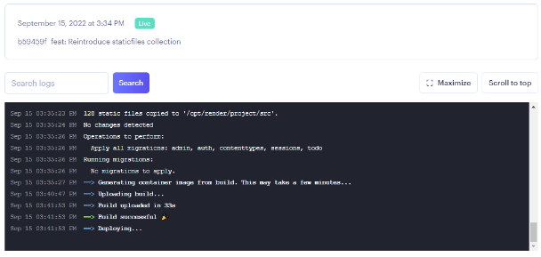
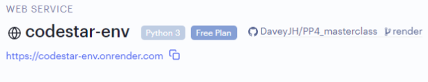
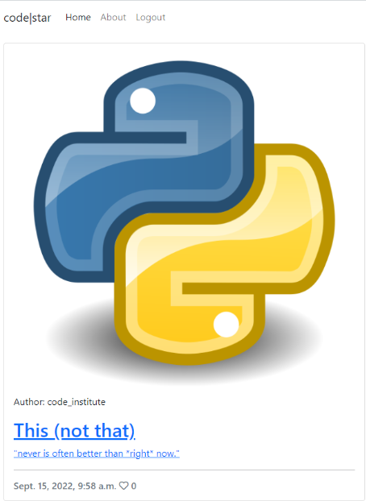

# I Think Therefore I Blog : Build & deployment

These are the final steps to deployment. First, the build is initiated. Then the build and deployment processes are carried out. Finally, the application is deployed and ready for public viewing.

The build process time varies depending on the complexity of the project, the currently available resources from Render.com and a number of other factors.

The build log is available to watch if desired, but this is the normal time to "grab a cuppa".

The build should complete with a "Build successful 🎉" message. The build then moves on to "Deploying..." and should complete with a "Starting service ..." message.

Once deployed, go forth and test! Don't forget, development does not stop at deployment. Make sure everything works as expected, configuration can be different in development and production versions of software so being thorough is always advised.

### Process

1\. Click "**Create Web Service**".

<figure><figcaption></figcaption></figure>

2\. Wait for deployment...

Watch the console for some activity, deployment can take **up to 15 minutes** to complete.

3\. Deployment completed!

<figure><figcaption></figcaption></figure>


If the build process does not appear to complete, please refer to [our troubleshooting docs](../../render.com/troubleshooting.md).


4\. Open the deployed site via the link below the WEB SERVICE name.

<figure><figcaption></figcaption></figure>


The URL can be copied to a clipboard using the provided copy icon. Handy for adding to a README.


5\. Enjoy your newly deployed web service!!

<figure><figcaption></figcaption></figure>


If for any reason this process has not succeeded, please refer to [our troubleshooting docs](../../render.com/troubleshooting.md).


### Up Next

That's it! The project is now deployed to Render.com and ready to be viewed by the public. Congratulations, please continue with the LMS content.
