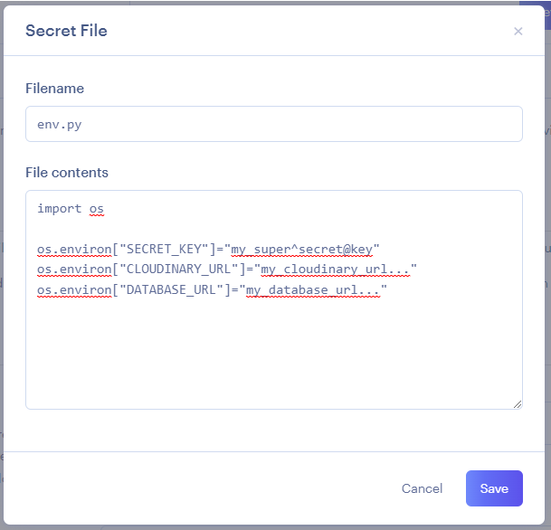

# I Think Therefore I Blog : Environment variables

During the development process, environment variables were stored in an ignored file, `env.py`. For the application to perform correctly, these hidden details are required in the production environment. Luckily, Render provides a couple of ways to give your application access to these details without exposing them to the public.

### Individual Variables

This allows the addition of individual environment variables.

This would be a good place for development and debug variables when needed.

### Secret File

This file will be available 'behind the scenes' just like an `env.py` file that is included in the `.gitignore`. It is not accessible to the public, so the security and secrecy of its content are maintained.


This also acts as a nice backup location of production environment variables should a GitPod workspace be lost without another external backup of the `env.py` file.


### Process

1\. Locate and click "**Advanced**".

<figure><figcaption></figcaption></figure>

2\. Click "**Add Environment Variable**"

<figure><figcaption></figcaption></figure>

3\. Add the following environment variable

<figure><figcaption></figcaption></figure>

| Key              | Value |
| ---------------- | ----- |
| WEB\_CONCURRENCY | 4     |


This setting is suggested by Render.com. It is related to the use of `gunicorn` and provides configuration details regarding how many work processes are permitted.



This value should not be changed for Django applications.


4\. Click "**Add Secret File**"

<figure><figcaption></figcaption></figure>

5\. Paste in the contents of the `env.py` (or `.env`) file that contains the environment variables and ensure the **Filename is identical** to the original.

<figure><figcaption></figcaption></figure>


Make sure to click "**Save**" when done.


### Up Next

The final option is whether to **Auto-Deploy**. The two options are explained in the following page.
