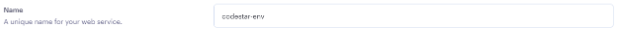
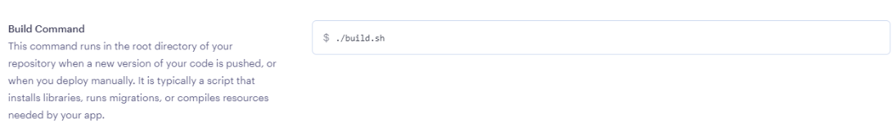
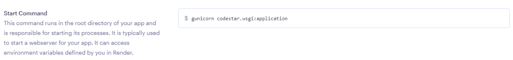
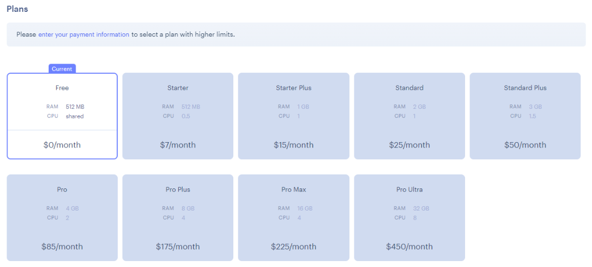

# I Think Therefore I Blog : Settings

A brief explanation of each setting is given below.

### Settings

#### Name

A name is chosen to help identify the deployment. This will be listed in the Render dashboard overview.

The name chosen will form part of the deployed URL. If the name is unique on Render.com, the resulting URL will be `<name>.onrender.com`. If the name is _not_ unique, a random hash with be appended to the name given, e.g. `<name>-3yk1.onrender.com`

#### Root Directory

The root directory of the project and its content. This can be edited if required, but usually it will remain blank, thus indicating the root directory of the repository is the same as the root directory of the web service.

#### Environment

The nature of the program so Render.com knows which of their configurations to use. With Python selected, Render will use the latest patch version of Python 3.7 as a default, but this is configurable.

#### Region

The physical location of the server hosting the web service. The location will slightly effect loading speeds etc.&#x20;

#### Branch

The branch that the service should be deployed from. This will often be `main` (or `master` for older repositories) but is configurable to any public branch within the repository.

#### Build Command

This is the command that is executed when the deployment build is initiated. The command instructs the build to run the **build.sh** file from the current working directory.

An alternative file name could be given as long as the relevant file exists, but **build.sh** is a fairly conventional name.

#### Start Command

This is the executable command that is run within a python terminal. `gunicorn` is an installed package, it then runs the **wsgi** file within the directory given. `:application` allows the `application` variable to be called upon.

### Process

1\. Add a **Name**

<figure><figcaption></figcaption></figure>

2\. Ensure the following settings match

| Setting Name   | Value                                                                                                                                 |
| -------------- | ------------------------------------------------------------------------------------------------------------------------------------- |
| Root Directory | \*\*blank\*\*                                                                                                                         |
| Environment    | **Python 3**                                                                                                                          |
| Region         | <p><strong>Frankfurt (EU Central)</strong><br><br><em>For those outside of Europe, a more localized region may be preferred.</em></p> |
| Branch         | <p><strong>main</strong><br><br><em>You can deploy from a different branch if required.</em></p>                                      |


3\. Set the **Build Command**

<figure><figcaption></figcaption></figure>

```shell
./build.sh
```


Using `./` before a file name in the command line is a common way to execute the file.



4\. Set the **Start Command**

<figure><figcaption></figcaption></figure>

```
gunicorn codestar.wsgi:application
```


Replace `codestar` with the directory name of your project. This name would have been generated via `django-admin startproject <PROJECT_NAME>` when the project repository was created.



5\. Ensure the **Free** plan $0/month is selected.

<figure><figcaption></figcaption></figure>


The requirements of the project are well within the free services offered by Render.com. Feel free to explore their [pricing structure](https://render.com/pricing) and [free plan limitations](https://render.com/docs/free#free-web-services).


### Up Next

The environment variables are needed. The next page details how to add them.
